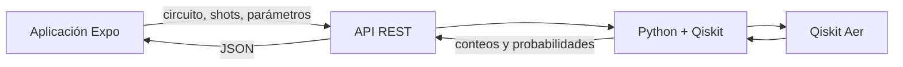

# QubitPacha

Aplicación móvil educativa que acerca la computación cuántica a estudiantes de secundaria mediante una experiencia visual, interactiva y progresiva inspirada en constelaciones y elementos culturales andinos.

El nombre combina **qubit** con *pacha*, palabra quechua asociada con mundo, tiempo y universo. El estudiante recorre constelaciones, completa misiones y construye intuiciones sobre bits, probabilidad, medición, superposición y circuitos cuánticos con la ayuda de **Kusi**, un colibrí curioso.

> **Nota cultural:** la identidad andina funciona como contexto visual y pedagógico. QubitPacha no afirma que los pueblos andinos conocieran la computación cuántica ni presenta analogías culturales como equivalencias científicas.

## Problema y propuesta

Existe una brecha entre los conocimientos escolares de matemáticas, física y computación y la forma en que normalmente se presentan las tecnologías cuánticas. QubitPacha parte de ideas familiares —sistema binario, lógica, probabilidad, ondas e interferencia— y construye una ruta gradual hacia qubits, superposición, medición y circuitos.

El objetivo no es almacenar la mayor cantidad de contenido, sino conseguir que una persona comprenda por primera vez una idea cuántica que antes parecía inaccesible.

## Estado actual del prototipo

El repositorio contiene una aplicación Expo navegable con dos recorridos:

- **Estudiante:** portada, onboarding, selección de guía, mapa de seis mundos, detalle del Mundo 1, cuatro misiones, retroalimentación, recompensas, diario y perfil.
- **Profesor:** resumen de clases, progreso general, lista de estudiantes, asignación de misiones y recursos pedagógicos.

También incluye:

- Estado global con Context y persistencia local mediante AsyncStorage.
- XP, estrellas y desbloqueo secuencial de misiones.
- Simulador local de uno y dos qubits en TypeScript.
- Assets de Kusi, chakana, galaxia y constelaciones andinas.
- Tipografías Lora y Nunito.
- Soporte para Android, iOS y web mediante Expo.

Los datos docentes son simulados. Todavía no existe autenticación, backend ni conexión activa con Qiskit.

## Demo ideal de dos minutos

La demostración central que guía el desarrollo es:

1. Fiorella presenta el problema de un profesor que quiere enseñar cuántica y no sabe cómo comenzar.
2. Se abre el mapa de constelaciones.
3. Un estudiante entra en la misión de probabilidad.
4. Predice qué ocurrirá al aplicar una puerta Hadamard.
5. Ejecuta 100 mediciones (*shots*).
6. Observa que los resultados individuales son inciertos, pero aparece un patrón cercano a 50/50.
7. Responde una pregunta conceptual sobre superposición y medición.
8. Obtiene una estrella para su constelación.
9. El profesor ve el resultado y recibe una recomendación pedagógica.

La guía detallada del pitch, tiempos, mensajes y criterios de éxito se encuentra en [docs/PITCH_DEMO.md](docs/PITCH_DEMO.md).

## Empezar

### Requisitos

- Node.js 18 o superior.
- npm.
- Expo Go compatible con SDK 54 para probar en un dispositivo.

### Instalación

```bash
git clone https://github.com/PedroRojasF/q-explorers.git
cd q-explorers
npm install
npx expo start
```

Desde la consola de Expo:

- Escanea el QR con Expo Go.
- Pulsa `a` para Android.
- Pulsa `i` para iOS en un entorno compatible.
- Pulsa `w` para web.

También puedes usar:

```bash
npm run android
npm run ios
npm run web
```

## Despliegue web con EAS Hosting

El proyecto utiliza un export web de tipo SPA (`expo.web.output: single`) y contiene un workflow en `.eas/workflows/deploy-web.yml` para publicar automáticamente cada push a `main` una vez que el repositorio esté vinculado con EAS.

### Primer despliegue

```bash
npx eas-cli@latest login
npx eas-cli@latest init
npm run deploy:web
```

El primer despliegue permite elegir el subdominio de preview y vincula la aplicación con un proyecto de Expo. `eas init` añadirá automáticamente `expo.extra.eas.projectId` a `app.json`.

### Publicar en producción

```bash
npm run deploy:web:prod
```

### Probar el bundle de producción localmente

```bash
npm run export:web
npm run serve:web
```

No agregues manualmente un `projectId`: debe generarlo EAS para la cuenta propietaria del proyecto.

## Flujo del estudiante

### Onboarding

1. Selección de rol: estudiante, profesor o invitado.
2. Bienvenida a QubitPacha.
3. Selección de guía: Kusi, Sami o Inti.
4. Entrada al mapa de constelaciones.

### Mapa y progreso

El mapa muestra seis mundos:

| Mundo | Tema | Estado |
|---|---|---|
| 1. Código secreto | Bits y quipus | Funcional |
| 2. Azar y probabilidad | Patrones y mediciones | Diseñado para la siguiente iteración |
| 3. Dos caminos | Superposición | Visible, pendiente |
| 4. Lazos invisibles | Entrelazamiento | Visible, pendiente |
| 5. La mirada cambia todo | Medición | Visible, pendiente |
| 6. Senderos cuánticos | Algoritmos | Visible, pendiente |

### Mundo 1 — Código secreto

- **El quipu digital:** relaciona representación y almacenamiento de información.
- **Bits en acción:** introduce combinaciones binarias.
- **Contar en binario:** practica secuencias y valor posicional.
- **Reto final:** conecta códigos ancestrales y digitales sin equipararlos históricamente.

Cada respuesta correcta entrega 10 XP, enciende una estrella y desbloquea la misión siguiente. Las misiones pueden repetirse.

## Flujo del profesor

El modo profesor utiliza datos locales para demostrar el valor pedagógico:

- Resumen de clases, estudiantes y misiones activas.
- Progreso promedio por clase.
- Misiones con mayor dificultad.
- Lista de estudiantes con XP y porcentaje de avance.
- Formulario para asignar misiones.
- Guías docentes y actividades para trabajar sin conexión.

La evolución prevista añade recomendaciones basadas en evidencia. Por ejemplo, si un estudiante interpreta un resultado 50/50 como una alternancia exacta, el profesor recibiría la sugerencia de repetir el experimento con 10, 100 y 1000 shots y comparar frecuencia observada con probabilidad teórica.

## Arquitectura actual

```text
q-explorers/
├── app/                         # Pantallas y rutas de Expo Router
│   ├── (tabs)/index.tsx         # Portada y selección de rol
│   ├── onboarding.tsx
│   ├── guide.tsx
│   ├── map.tsx
│   ├── world/[id].tsx
│   ├── mission/[id].tsx
│   ├── reward.tsx
│   ├── missions.tsx
│   ├── journal.tsx
│   ├── profile.tsx
│   ├── teacher.tsx
│   ├── class/[id].tsx
│   ├── assign.tsx
│   └── resources.tsx
├── assets/qubitpacha/           # Logo, Kusi, galaxia y constelaciones
├── components/JourneyUI.tsx     # Componentes visuales compartidos
├── constants/Colors.ts          # Paleta semántica
├── data/journey.ts              # Mundos, misiones y datos docentes
├── data/lessons.ts              # Contenido cuántico previo
├── lib/JourneyContext.tsx       # Rol, guía, progreso y persistencia
├── lib/quantum.ts               # Simulador local de 1–2 qubits
├── app.json
├── package.json
└── tsconfig.json
```

## Arquitectura científica objetivo

La aplicación móvil y el motor científico se mantienen separados:



Tecnologías previstas para el motor científico:

- **Python:** lógica y servicio backend.
- **Qiskit:** construcción de circuitos.
- **Qiskit Aer:** simulación por shots.
- **NumPy:** cálculos de ondas e interferencia.
- **Matplotlib:** validación de histogramas y visualizaciones durante el prototipado.
- **ipywidgets:** pruebas interactivas en Google Colab o Jupyter.

Mientras no exista la API, `services/quantumService.ts` conserva el contrato `runHadamardExperiment(shots)` y entrega un resultado local estable para la demo. La interfaz identifica este resultado como **modo demo** y no afirma que provenga de hardware remoto. Al conectar el backend, basta con reemplazar la implementación del servicio sin modificar las pantallas del laboratorio.

El flujo implementado conecta la misión **Bits en acción** con:

1. La formulación de una hipótesis sobre la puerta Hadamard.
2. La ejecución de 100 mediciones.
3. La comparación visual de resultados 0 y 1.
4. Una explicación conceptual de superposición y medición.
5. La insignia **Primer Experimento Cuántico**.
6. El reporte y la recomendación pedagógica en el panel docente.

## Contrato REST propuesto

Ejemplo de solicitud para una moneda cuántica:

```http
POST /api/v1/simulations/hadamard
Content-Type: application/json

{
  "shots": 100,
  "initialState": "0"
}
```

Respuesta esperada:

```json
{
  "circuit": "H q[0]; measure q[0]",
  "shots": 100,
  "counts": { "0": 48, "1": 52 },
  "probabilities": { "0": 0.48, "1": 0.52 }
}
```

En una integración real, los valores variarán entre ejecuciones. El resultado fijo de la demo local existe únicamente para garantizar una presentación reproducible sin conexión.

## Identidad visual

La interfaz evita morados, rosas y estética cyberpunk. Utiliza:

- Cielo azul petróleo para mapas, mundos y recompensas.
- Crema cálido para lectura, ejercicios y paneles docentes.
- Naranja solar, turquesa lago y dorado maíz como acentos.
- Lora para títulos y Nunito para interfaz.
- Chakana, quipu y constelaciones como motivos usados con moderación.

Los tokens principales viven en `constants/Colors.ts`.

## Estado global y persistencia

`lib/JourneyContext.tsx` mantiene:

- Rol seleccionado.
- Guía elegida.
- Misiones completadas.
- XP y estrellas derivados del progreso.
- Resultado experimental futuro.

El estado se guarda en AsyncStorage bajo el namespace `@qubitpacha/journey-v1` y se restaura al abrir la aplicación.

## Accesibilidad y rendimiento

- Objetivos táctiles principales de al menos 44 px.
- Contraste alto entre crema y azul nocturno.
- Estados acompañados por texto o iconos, no solo color.
- Assets locales para funcionamiento predecible.
- Animaciones y simulaciones pequeñas pensadas para dispositivos Android de gama media.

## Verificación

```bash
npx tsc --noEmit
npx expo-doctor
```

Antes de publicar cambios, ambas verificaciones deben terminar sin errores.

## Trabajo en equipo

Flujo recomendado:

```bash
git pull
git switch -c feat/nombre-corto
# cambios y pruebas
git commit -m "feat: descripción breve"
git push -u origin feat/nombre-corto
```

- Una funcionalidad por rama.
- Commits descriptivos.
- Pull requests pequeños y revisables.
- No mezclar cambios de contenido, interfaz y backend cuando puedan revisarse por separado.

## Hoja de ruta

- Conectar `quantumService` con una API REST de Qiskit e IBM Quantum.
- Ampliar la misión de Hadamard con 10, 100 y 1000 shots.
- Sustituir las métricas docentes de demostración por datos persistentes por clase.
- Completar los mundos 2 a 6.
- Crear API REST con Python, Qiskit y Qiskit Aer.
- Sincronizar progreso entre dispositivos.
- Añadir autenticación y separación real por clases.
- Ampliar accesibilidad y pruebas automatizadas.
- Explorar localización bilingüe español/quechua con revisión cultural.

## Licencia y recursos

Antes de distribuir públicamente, el equipo debe definir una licencia para el código y documentar la procedencia/licencia de cada asset visual. Lora y Nunito se distribuyen bajo SIL Open Font License.
